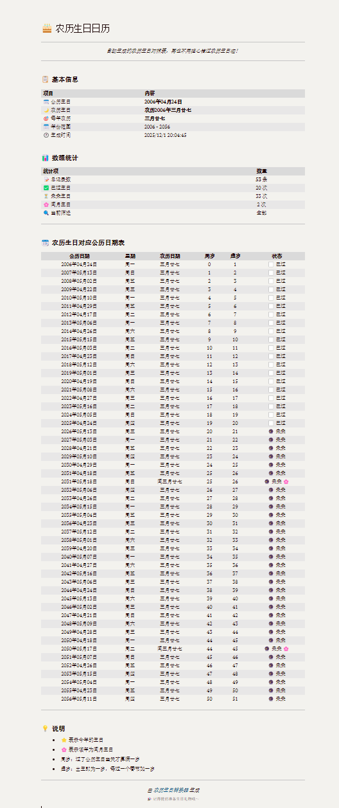

<div align="center">

# 🎂 农历生日转换器

**将公历生日一键转换为多年农历生日对照表**

[](https://www.python.org/)
[](https://flask.palletsprojects.com/)
[](./LICENSE)

[功能特性](#-功能特性) • [快速开始](#-快速开始) • [使用方式](#-使用方式) • [API 文档](#-api-文档)

</div>

---

## ✨ 功能特性

| 功能 | 说明 |
| :--- | :--- |
| 🔄 **批量转换** | 输入公历生日，一次性生成未来 50/80/100 年的农历生日对应公历日期 |
| 🌙 **闰月支持** | 可选包含闰月生日，结果按公历时间轴排序 |
| 🔍 **智能筛选** | 支持筛选「全部 / 未来 / 已过」，快速跳转到指定年份 |
| 📤 **一键导出** | 导出精美的 Markdown 日历表，便于保存或分享 |
| ⚡ **开箱即用** | 前端单页 + Flask API，无需复杂配置 |

## 🤗页面预览

## 📖 生成 Markdown 结果预览


## 📦 环境要求

- **Python** 3.9+
- **依赖包**：`flask`、`flask-cors`、`lunardate`
- 现代浏览器（Chrome / Firefox / Edge / Safari）

## 🚀 快速开始

### 1. 克隆项目

```bash
git clone https://github.com/sgahch/lunar-brithday.git
cd lunar-birthday
```

### 2. 安装依赖

```bash
# 创建虚拟环境（推荐）
python -m venv .venv

# 激活虚拟环境
# Windows
.\.venv\Scripts\activate
# macOS / Linux
source .venv/bin/activate

# 安装依赖
pip install flask flask-cors lunardate
```

### 3. 启动服务

```bash
python lunar.py
```

🎉 访问 **http://127.0.0.1:5000** 即可开始使用！

## 📖 使用方式

1. 在页面中选择「公历出生日期」
2. 设置「计算年数」（50 / 80 / 100 年）
3. 根据需要勾选「包含闰月生日」
4. 点击 **开始转换** 按钮
5. 在结果表格中可以：
   - 按状态筛选（全部 / 未来 / 已过）
   - 快速跳转到指定年份
   - 点击「导出 Markdown」保存为 `.md` 文件

## 🔌 API 文档

### `POST /api/convert`

将公历生日转换为多年农历生日对照表。

**请求体示例：**

```json
{
  "birth_date": "1995-06-18",
  "years_count": 100,
  "include_leap": true
}
```

**响应字段：**

| 字段 | 类型 | 说明 |
| :--- | :--- | :--- |
| `birth_solar` | string | 公历出生日期 |
| `birth_lunar` | string | 农历出生日期 |
| `lunar_month_name` | string | 农历月份名称 |
| `lunar_day_name` | string | 农历日期名称 |
| `results` | array | 转换结果数组 |

**results 数组元素：**

| 字段 | 说明 |
| :--- | :--- |
| `solar_date` | 公历日期 |
| `lunar_date` | 农历日期 |
| `weekday` | 星期几 |
| `age` | 周岁 |
| `age_xu` | 虚岁 |
| `is_leap_birthday` | 是否闰月生日 |
| `is_past` | 是否已过 |

## 📁 项目结构

```
lunar-birthday-converter/
├── index.html      # 前端页面
├── app.js          # 前端交互逻辑
├── lunar.py        # Flask 后端服务
├── lunar.txt       # 测试脚本示例
└── README.md       # 项目文档
```

## ⚠️ 注意事项

- 📅 支持的年份范围：**1900 - 2099**（受 `lunardate` 库限制）
- 🔧 默认端口 5000，如被占用可修改 `lunar.py` 中的 `app.run()` 配置
- ⚡ 如遇极端日期转换失败（如闰月边界），接口会返回错误提示

## 🌐 云服务器部署指南

以下指南适用于 **Ubuntu/Debian** 系统，使用 **Nginx + Gunicorn** 方案进行生产环境部署。

### 1. 服务器环境准备

```bash
# 更新系统
sudo apt update && sudo apt upgrade -y

# 安装必要软件
sudo apt install -y python3 python3-pip python3-venv nginx git
```

### 2. 部署项目文件

```bash
# 创建项目目录
sudo mkdir -p /var/www/lunar-birthday
cd /var/www/lunar-birthday

# 方式一：从 GitHub 克隆
sudo git clone https://github.com/sgahch/lunar-brithday.git .

# 方式二：手动上传（使用 scp）
# 在本地执行：scp -r ./* user@your-server-ip:/var/www/lunar-birthday/

# 设置目录权限
sudo chown -R www-data:www-data /var/www/lunar-birthday
```

### 3. 配置 Python 虚拟环境

```bash
cd /var/www/lunar-birthday

# 创建虚拟环境
sudo python3 -m venv venv

# 激活虚拟环境
source venv/bin/activate

# 安装依赖
pip install flask flask-cors lunardate gunicorn
```

### 4. 创建 Gunicorn 系统服务

```bash
# 创建 systemd 服务文件
sudo nano /etc/systemd/system/lunar-birthday.service
```

粘贴以下内容：

```ini
[Unit]
Description=Lunar Birthday Converter - Gunicorn Service
After=network.target

[Service]
User=www-data
Group=www-data
WorkingDirectory=/var/www/lunar-birthday
Environment="PATH=/var/www/lunar-birthday/venv/bin"
ExecStart=/var/www/lunar-birthday/venv/bin/gunicorn --workers 3 --bind 127.0.0.1:5000 lunar:app
Restart=always
RestartSec=5

[Install]
WantedBy=multi-user.target
```

启动服务：

```bash
# 重新加载 systemd 配置
sudo systemctl daemon-reload

# 启动服务
sudo systemctl start lunar-birthday

# 设置开机自启
sudo systemctl enable lunar-birthday

# 查看服务状态
sudo systemctl status lunar-birthday
```

### 5. 配置 Nginx 反向代理

```bash
# 创建 Nginx 配置文件
sudo nano /etc/nginx/sites-available/lunar-birthday
```

粘贴以下内容（请将 `your-domain.com` 替换为你的域名或服务器IP）：

```nginx
server {
    listen 80;
    server_name your-domain.com;  # 替换为你的域名或 IP

    location / {
        proxy_pass http://127.0.0.1:5000;
        proxy_set_header Host $host;
        proxy_set_header X-Real-IP $remote_addr;
        proxy_set_header X-Forwarded-For $proxy_add_x_forwarded_for;
        proxy_set_header X-Forwarded-Proto $scheme;
    }

    # 静态文件缓存优化
    location ~* \.(js|css|png|jpg|jpeg|gif|ico)$ {
        proxy_pass http://127.0.0.1:5000;
        expires 7d;
        add_header Cache-Control "public, immutable";
    }
}
```

启用配置：

```bash
# 创建软链接启用站点
sudo ln -s /etc/nginx/sites-available/lunar-birthday /etc/nginx/sites-enabled/

# 测试 Nginx 配置
sudo nginx -t

# 重启 Nginx
sudo systemctl restart nginx
```

### 6. 配置防火墙（可选）

```bash
# 允许 HTTP 和 HTTPS 流量
sudo ufw allow 'Nginx Full'
sudo ufw enable
sudo ufw status
```

### 7. 配置 HTTPS（推荐）

使用 Let's Encrypt 免费证书：

```bash
# 安装 Certbot
sudo apt install -y certbot python3-certbot-nginx

# 获取并配置证书（替换为你的域名）
sudo certbot --nginx -d your-domain.com

# 证书会自动续期，可手动测试续期
sudo certbot renew --dry-run
```

### 8. 常用运维命令

```bash
# 查看服务状态
sudo systemctl status lunar-birthday

# 重启服务
sudo systemctl restart lunar-birthday

# 查看服务日志
sudo journalctl -u lunar-birthday -f

# 重启 Nginx
sudo systemctl restart nginx

# 查看 Nginx 错误日志
sudo tail -f /var/log/nginx/error.log
```

### 9. 部署验证

部署完成后，访问以下地址验证：

- **主页**：`http://your-domain.com`
- **API 测试**：`http://your-domain.com/api/test`

如果看到 `{"status": "ok", "message": "农历生日转换器API正常运行"}`，说明部署成功！

### 📋 部署清单速查

| 步骤 | 命令 |
| :--- | :--- |
| 启动服务 | `sudo systemctl start lunar-birthday` |
| 停止服务 | `sudo systemctl stop lunar-birthday` |
| 重启服务 | `sudo systemctl restart lunar-birthday` |
| 查看日志 | `sudo journalctl -u lunar-birthday -f` |
| 重启 Nginx | `sudo systemctl restart nginx` |

## 📄 开源许可

本项目采用 [MIT License](./LICENSE) 开源许可证。

---

<div align="center">

**如果这个项目对你有帮助，欢迎 ⭐ Star 支持一下！**

Made with ❤️ by [YaenChen](https://github.com/YaenChen)

</div>